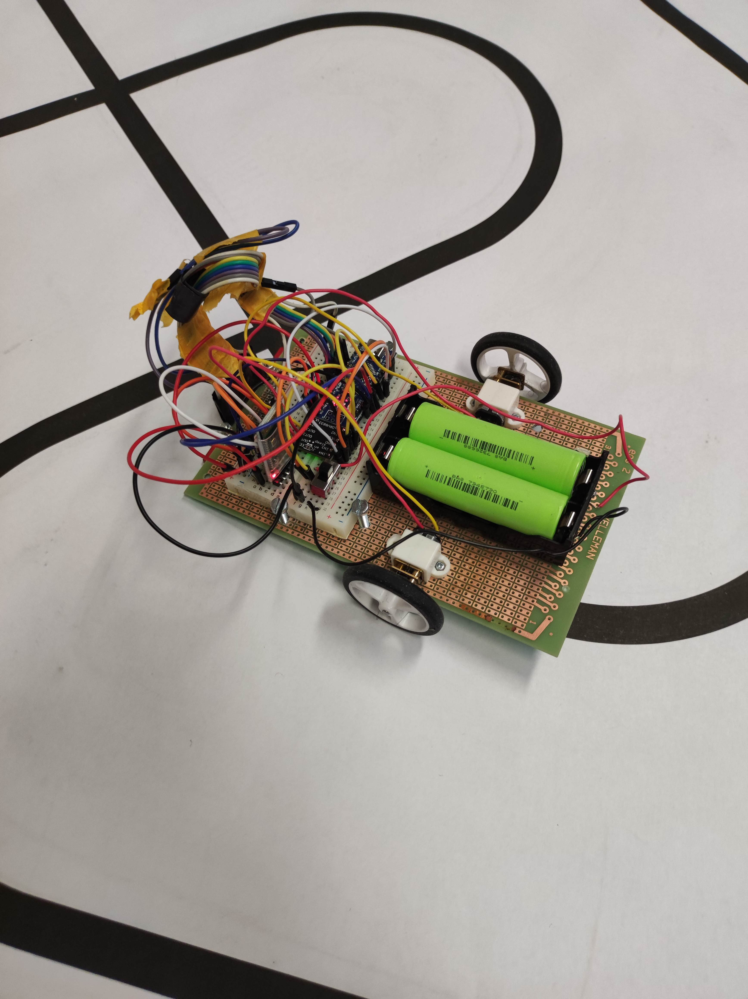

# LineFollower

lege repository die je als template kan gebruiken om een eigen repository te starten voor uw linefollower project

  
## specifications

microcontroller: Arduino Nano

motors: 6V DC micro 50:1

h-bridge: DRV8833

sensors: HY-S301

batteries: Lion 18650-2900mAh

wireless communication: HC-05

distance sensor - motors:

weight:

speed: 0.5

